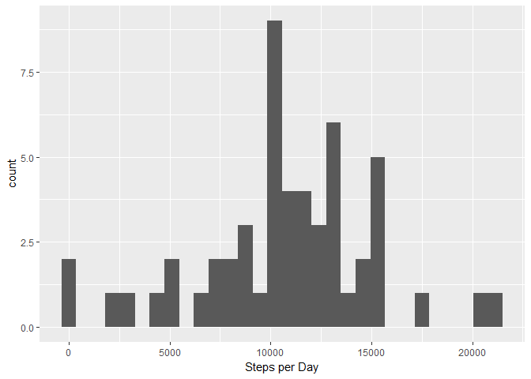
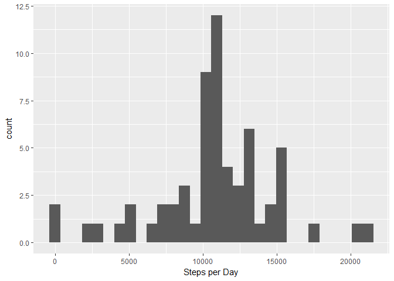

# Reproducible Research: Peer Assessment 1


####In this document I describe different steps of processing the activity data.


## Loading and preprocessing the data
The following code will load the activity.csv file into a data frame called data:

```r
data<-read.csv("activity.csv")
head(data,3)
```

```
##   steps       date interval
## 1    NA 2012-10-01        0
## 2    NA 2012-10-01        5
## 3    NA 2012-10-01       10
```
next, convert date column from character to date-time class POSIXlt:

```r
data$date<-strptime(data$date,"%Y-%m-%d")
data$date[1]$mday
```

```
## [1] 1
```


## What is mean total number of steps taken per day?
first, we need to plot the histogram of steps-per-day:

```r
library(ggplot2)
fac <- factor(paste(as.character(data$date$mon),as.character(data$date$mday)))
qplot(tapply(data$steps,fac,sum),xlab='Steps per Day')
```

```
## `stat_bin()` using `bins = 30`. Pick better value with `binwidth`.
```

```
## Warning: Removed 8 rows containing non-finite values (stat_bin).
```

<!-- -->

now, we calculate the mean and median of totall # of steps per day

```r
print(mean(sapply(split(data$steps,fac),sum),na.rm=1))
```

```
## [1] 10766.19
```

```r
print(median(sapply(split(data$steps,fac),sum),na.rm=1))
```

```
## [1] 10765
```


## What is the average daily activity pattern?
Now let's take a look at the daily pattern:

```r
fac2<-factor(data$interval)
pattern<-tapply(data$steps,fac2,mean,na.rm=1)
qplot(1:288,pattern,geom = 'line',xlab = 'time of the day', ylab = 'average steps per 5-min interval')
```

<!-- -->

As expected, steps are maximum during the morning hours, and declines toward the night. We can find the maximumas follows:
'''{r}
which.max(pattern)
```
the maximumis 104 steps which occures between 8:35am and 8:40am.


## Imputing missing values
first, we calculate how many missing data is in the table:

```r
sum(is.na(data$steps))
```

```
## [1] 2304
```
2304 values are missing. Now we can replace the NA with the average corresponding to that interval, which we calculated previously. The following code replaces NAs with the values from pattern:

```r
for (i in which(is.na(data$steps))) {
data$steps[i]=round(pattern[as.character(data$interval[i])])
}
head(data,4)
```

```
##   steps       date interval
## 1     2 2012-10-01        0
## 2     0 2012-10-01        5
## 3     0 2012-10-01       10
## 4     0 2012-10-01       15
```
the histogram of the new data fram looks like this:

```r
qplot(tapply(data$steps,fac,sum),xlab='Steps per Day')
```

```
## `stat_bin()` using `bins = 30`. Pick better value with `binwidth`.
```

<!-- -->
but in order to realize the impact of replacing missing data, we need to calculate the new mean and median:

```r
print(mean(sapply(split(data$steps,fac),sum),na.rm=1))
```

```
## [1] 10765.64
```

```r
print(median(sapply(split(data$steps,fac),sum),na.rm=1))
```

```
## [1] 10762
```
as you see, the values for mean and median are slightly decreased. Replacing the missing values make our analysis more realistic. 

## Are there differences in activity patterns between weekdays and weekends?
to do this, we first create a factor for weekdays and weekends:

```r
isweekend=weekdays(data$date)=="Sunday" | weekdays(data$date)=="Saturday"
fac3=factor(isweekend,labels=c("Weekday","Weekend"))
head(fac3)
```

```
## [1] Weekday Weekday Weekday Weekday Weekday Weekday
## Levels: Weekday Weekend
```
Now, we can plot the patterns of weekdays and weekened side by side. Here I used smooth function to find the pattern:

```r
data$isweekend=fac3
ggplot(data,aes(interval,steps))+geom_smooth()+facet_wrap(~isweekend)
```

```
## `geom_smooth()` using method = 'gam'
```

<!-- -->
as appears, on weekends, the person wakes up about 2:30 later than weekdays!

